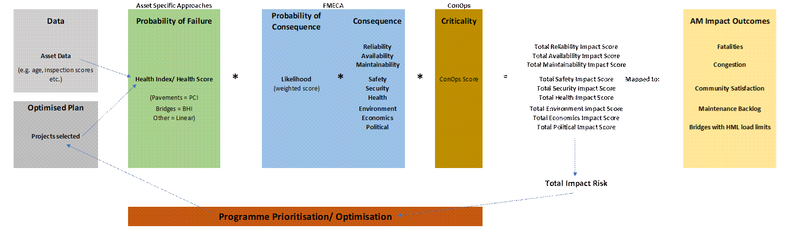

# Transport for New South Wales Bid

## Project Description

As part of the joint venture bid for TFNSW, he was tasked with generating WLC models for 30+ asset types grouped into 4 major categories (pavements, bridges, corridors and ITS) using Enterprise for Decision Analytics (EDA) for asset deterioration modelling (Probability of Failure). Other approaches were applied in generating Criticality and Probability of Consequence to arrive at asset specific total impact scores which were used as metrics in Universal Visual Optimizer (UVO) to optimize selected programs based on pre-identified scenarios.

The key output was a Qlik dashboard app configured to present the planned investments within the proposed methodologies, a spatial representation of a bush-fire scenario alongside its financial implications and a risk matrix over a 10 year period.

## Status

Arcadis lost the bid.  

## Role

- Tayo Ososanya - Data Analyst
- Richard Davey - Data Analyst
- Dan Scott - Consultant

 

## Contacts 

- Dan Scott - Director of Analytics

## Asset Hierarchy

| Asset Class | Asset Type                             |
| ----------- | -------------------------------------- |
| Bridge      | Electrical / Mechanical Assets         |
| Bridge      | Bridge                                 |
| Bridge      | Bridge Size Culvert                    |
| Bridge      | Tunnel Structure                       |
| Bridge      | Lifts                                  |
| Pavement    | Flexible Pavement                      |
| Pavement    | Asphalt Surface                        |
| Pavement    | Concrete Surface                       |
| Pavement    | Rigid Pavement                         |
| Pavement    | Sprayed Seal                           |
| Corridor    | Culvert                                |
| Corridor    | Safety  Barrier                        |
| Corridor    | Stormwater  Quality Improvement Device |
| Corridor    | Other                                  |
| Corridor    | Slope  Site                            |
| Corridor    | Open  Drainage                         |
| Corridor    | Kerb  gutter                           |
| Corridor    | Cycleways                              |
| Corridor    | Noise  Wall                            |
| ITS         | Changeable  Message Signs              |
| ITS         | CCTV Cameras                           |
| ITS         | Emergency  phone                       |
| ITS         | Advanced  Warning Sign                 |
| ITS         | Traffic Monitoring Unit                |
| ITS         | Over  height Detection System          |
| ITS         | Street Light                           |
| ITS         | School  Zone Sign                      |
| ITS         | Traffic  Control System                |
| ITS         | Variable  Speed Limit Sign             |
| ITS         | Variable  Message Sign                 |

## KPIs 

The following were the KPIs used in UVO during scenario modelling.

| KPI Group         | KPIs                                           |
| ----------------- | ---------------------------------------------- |
| Failures          | POF                                            |
| Impact Risk       | POF_FMECA_CONOPS                               |
| Impact Risk       | POF_FMECA_Reliability_CONOPS                   |
| Impact Risk       | POF_FMECA_Availability_CONOPS                  |
| Impact Risk       | POF_FMECA_Maintainability_CONOPS               |
| Impact Risk       | POF_FMECA_Safety_CONOPS                        |
| Impact Risk       | POF_FMECA_Security_CONOPS                      |
| Impact Risk       | POF_FMECA_Health_CONOPS                        |
| Impact Risk       | POF_FMECA_Economics_CONOPS                     |
| Impact Risk       | POF_FMECA_Environment_CONOPS                   |
| Impact Risk       | POF_FMECA_Political_CONOPS                     |
| Costing           | Total_Cost                                     |
| Costing           | Total_Cost_Bridges                             |
| Costing           | Total_Cost_Pavement                            |
| Costing           | Total_Cost_Corridor                            |
| Costing           | Total_Cost_ITS                                 |
| In_Backlog        | In_Backlog                                     |
| AM Impact Outcome | Equivalent_Annual_Fatalities                   |
| AM Impact Outcome | Community_Safety_Infra_Effectiveness_Score     |
| AM Impact Outcome | Community_Surface_Quality_and_Smoothness_Score |

## Methodology

Certain assets were not given programmes/projects (initially) and part of the task was to add these assets as projects to the backlog if the asset was below the selected deterioration threshold (POF).

**POF**

- Bridge Health Index
- Pavement Condition Index
- Linear deterioration models

**Criticality**

- ConOps Score

**POC**

- Likelihood weighted score (e.g. 0.001)

#### Pavements

- Modelled using HDM4 Methodology. The Flexible pavements model used in LTC Project was used here. 

#### Bridges

- Modelled using Australian Roads - Guidelines for Bridge Management Documentation. 

- Markov chain matrix was applied to Bridges for asset deterioration modelling.

#### Corridors

- Linear modelling.

#### ITS

- Linear modelling.

## File-location

It is located on the SSD 

> D:\Desktop\NSW

## Scripts

The scripts used are on [tfnsw_2020](https://github.com/tayoso2/tfnsw_2020)

